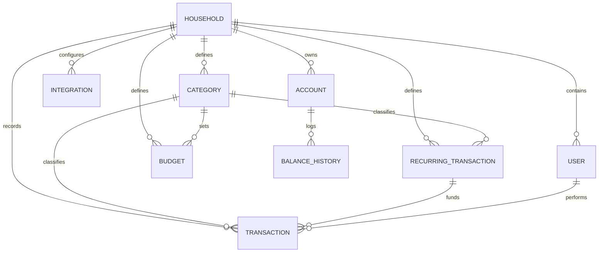
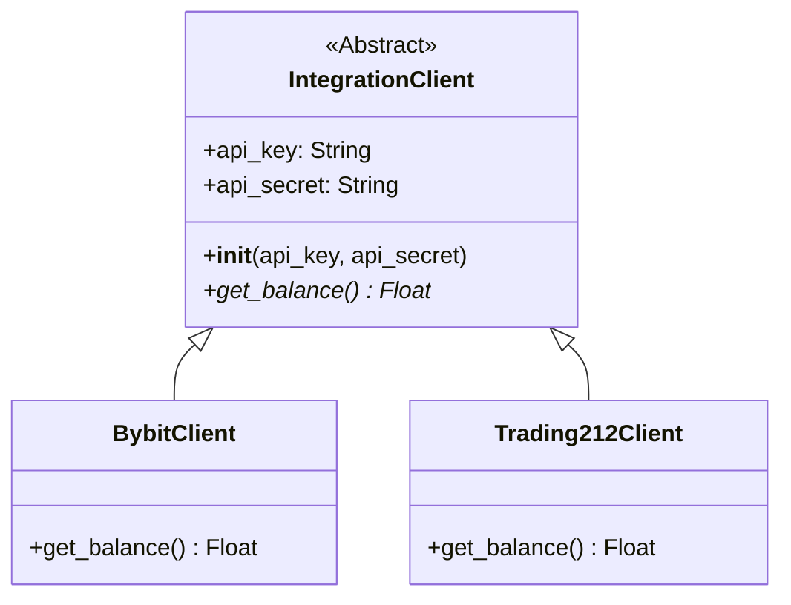

# BudgetingApp Architecture Documentation

This document describes the high-level architecture, database schema, core business logic, third-party integrations, and infrastructure layout of the **BudgetingApp** project. It is written to provide immediate context and onboarding for any future developer or LLM agent continuing work on this repository.

---

## 1. High-Level Overview

BudgetingApp is a multi-user, multi-tenant (household-scoped) personal finance tracking and budgeting application. It allows families or groups (organized in "Households") to track expenses, manage cash and investment accounts, set category budgets, define recurring income or expense templates, sync balances from exchange/broker APIs (Bybit, Trading212), and visualize net worth and transaction history over time.

### Technology Stack
- **Backend Framework**: Flask (Python 3.9)
- **ORM / Database Access**: Flask-SQLAlchemy (PostgreSQL in production/docker; SQLite for local development)
- **Session Management / Auth**: Flask-Login
- **Integrations API Clients**: `pybit` (Bybit client), `requests` (for Trading212 REST API calls)
- **Deployment**: Docker & Docker Compose

---

## 2. Database Schema & Data Model

The application uses an RDBMS (configured for PostgreSQL or SQLite). All data except for user credentials and database housekeeping are logically partitioned at the **Household** level to enforce isolation.

### Entity-Relationship Diagram



### Models Reference (`models.py`)

1. **`Household`**
   - **Purpose**: Groups users and partitions all financial records.
   - **Fields**:
     - `id` (Integer, Primary Key)
     - `name` (String(100), Nullable=False)
     - `join_code` (String(20), Unique, Nullable=False): A unique token (UUID slug) shared with other users so they can join the household.
     - `base_currency` (String(3), Default='USD'): The target currency used to aggregate balances and index transactions.
     - `created_at` (DateTime, Default=UTC now)
   - **Relationships**: Has one-to-many lazy-loaded relationships with `User`, `Account`, `Integration`, `Transaction`, `RecurringTransaction`, and `Category`.

2. **`User`**
   - **Purpose**: Individual account logins belonging to a household.
   - **Fields**:
     - `id` (Integer, Primary Key)
     - `username` (String(80), Unique, Nullable=False)
     - `password_hash` (String(200), Nullable=False): Hashed using Werkzeug security functions.
     - `household_id` (Integer, ForeignKey to `household.id`, Nullable=True): Users must create or join a household to access dashboard actions.

3. **`Account`**
   - **Purpose**: Cash holdings or investment portfolios.
   - **Fields**:
     - `id` (Integer, Primary Key)
     - `name` (String(100), Nullable=False)
     - `type` (String(20), Nullable=False): e.g., `'Cash'`, `'Investment'`.
     - `balance` (Float, Default=0.0): Current asset/cash balance.
     - `invested_amount` (Float, Default=0.0): Book cost / capital invested (used to determine profit/loss on investment accounts).
     - `currency` (String(10), Default='USD')
     - `household_id` (Integer, ForeignKey to `household.id`, Nullable=False)
   - **Relationships**: One-to-many to `BalanceHistory`.

4. **`BalanceHistory`**
   - **Purpose**: Stores daily snapshots of account valuation for performance charting.
   - **Fields**:
     - `id` (Integer, Primary Key)
     - `account_id` (Integer, ForeignKey to `account.id`, Nullable=False)
     - `balance` (Float, Nullable=False)
     - `invested_amount` (Float, Nullable=False)
     - `date` (DateTime, Default=UTC now)

5. **`Integration`**
   - **Purpose**: API key configurations to pull financial data automatically.
   - **Fields**:
     - `id` (Integer, Primary Key)
     - `platform` (String(50), Nullable=False): Supported values: `'bybit'`, `'trading212'`.
     - `api_key` (String(200))
     - `api_secret` (String(200), Nullable=True)
     - `last_synced` (DateTime, Nullable=True)
     - `household_id` (Integer, ForeignKey to `household.id`, Nullable=False)

6. **`Category`**
   - **Purpose**: Spending and income taxonomies.
   - **Fields**:
     - `id` (Integer, Primary Key)
     - `name` (String(50), Nullable=False)
     - `type` (String(20), Nullable=False): `'expense'`, `'income'`, or `'savings'`.
     - `household_id` (Integer, ForeignKey to `household.id`, Nullable=False)
   - **Relationships**: One-to-many to `Budget` and `Transaction`.

7. **`Budget`**
   - **Purpose**: Defines spending ceilings on categories.
   - **Fields**:
     - `id` (Integer, Primary Key)
     - `category_id` (Integer, ForeignKey to `category.id`, Nullable=False)
     - `amount_limit` (Float, Nullable=False)
     - `currency` (String(3), Default='USD')
     - `period` (String(20), Default='monthly')
     - `household_id` (Integer, ForeignKey to `household.id`, Nullable=False)

8. **`Transaction`**
   - **Purpose**: Individual cash inflows or outflows.
   - **Fields**:
     - `id` (Integer, Primary Key)
     - `amount` (Float, Nullable=False)
     - `currency` (String(3), Default='USD')
     - `amount_in_base_currency` (Float, Default=0.0): Denormalized amount converted at the moment of creation/edit to simplify aggregation.
     - `description` (String(200))
     - `date` (DateTime, Default=UTC now)
     - `type` (String(20), Nullable=False): `'income'`, `'expense'`, or `'investment'`.
     - `category_id` (Integer, ForeignKey to `category.id`, Nullable=True)
     - `income_source_id` (Integer, ForeignKey to `recurring_transaction.id`, Nullable=True): Linked recurring income stream (essential for budget/rollover tracking).
     - `user_id` (Integer, ForeignKey to `user.id`, Nullable=False)
     - `household_id` (Integer, ForeignKey to `household.id`, Nullable=False)

9. **`RecurringTransaction`**
   - **Purpose**: Templates for scheduled cash flows (salary, rent, subscriptions).
   - **Fields**:
     - `id` (Integer, Primary Key)
     - `amount` (Float, Nullable=False)
     - `currency` (String(3), Default='USD')
     - `description` (String(200))
     - `frequency` (String(20), Nullable=False): `'weekly'`, `'monthly'`, or `'yearly'`.
     - `next_due_date` (DateTime, Nullable=False)
     - `type` (String(20), Nullable=False): `'income'` or `'expense'`.
     - `category_id` (Integer, ForeignKey to `category.id`, Nullable=True)
     - `household_id` (Integer, ForeignKey to `household.id`, Nullable=False)
     - `total_avail_override` (Float, Nullable=True): User override for total monthly available funds.
     - `spent_override` (Float, Nullable=True): User override for month-to-date spent amount.
     - `remaining_override` (Float, Nullable=True): User override for month-to-date remaining funds.

---

## 3. Key Algorithms & Core Business Logic

### A. Currency Conversion (`currency_utils.py`)
Multi-currency calculations are governed by the `CurrencyConverter` utility class. It houses a static dictionary of exchange rates (base: USD) and currency symbols:
- `RATES` mapping: `USD: 1.0`, `EUR: 0.92`, `MKD: 56.5`
- `convert(amount, from_currency, to_currency)`:
  1. Standardizes amount to USD by dividing by `RATES[from_currency]`.
  2. Converts to target currency by multiplying by `RATES[to_currency]`.
  3. Rounds output to 2 decimal places.

> [!NOTE]
> When a Household base currency is updated (via `/set_currency` or `/settings`), the application iterates over all transaction records for that household and updates their `amount_in_base_currency` values inline to prevent query slowdowns.

### B. Income Rollover Calculation
The application features a rolling budget balance for dynamic income sources (e.g. allocating expenses/savings against a specific salary). Under `/budgets` (in `app.py`), the rollover surplus or deficit is computed dynamically per income source (`RecurringTransaction` of type `income`):

For each income source:
1. Locate the earliest linked `Transaction` record (`income_source_id == inc.id`).
2. If records exist, calculate starting date boundaries from that transaction's date up to the current calendar month.
3. For each previous month in that window:
   - Query all transactions associated with this `income_source_id`.
   - Calculate total net spending: `past_month_spent = Sum(Expenses) + Sum(Investments) - Sum(Extra Incomes)`.
   - Compute surplus: `monthly_surplus = income_source.amount - past_month_spent`.
   - Add to cumulative `rollover`.
4. Combine the rollover with the current month's default income amount to compute the `total_available` budget.
5. Deduct current month expenditures from `total_available` to calculate remaining funds and budget progress.

### C. Recurring Transaction Engine & Editing
1. **Recurring Process**: The `/check_recurring` endpoint processes due subscriptions, bills, or salary inputs:
   - It compares `next_due_date` against `now` for all `RecurringTransaction` definitions in the user's household.
   - For each due transaction, it inserts a new `Transaction` object into the ledger and advances the `next_due_date` (+7 days for weekly, +30 days for monthly, +365 days for yearly).
   - Commits changes to the database.
2. **Editing & Updating (e.g., Paycheck Raises)**: Recurring transactions (like paycheck income sources) are editable. Passing `edit_recurring_id` as a query parameter to `/budgets` retrieves the transaction and populates the budget form in "Edit Mode". Submitting the form posts to `/recurring/update/<int:id>`, which updates the `amount`, `description`, `frequency`, `next_due_date`, `currency`, and `category_id`, committing the changes to the database.

### D. Investment Account Tracking
When a user adds a transaction with type `'investment'` that lists a target `integration_id`, the system:
1. Resolves the corresponding `Account` name (e.g., `"{platform.capitalize()} Account"`).
2. Converts the transaction value to the target account's native currency.
3. Increments the `invested_amount` (cost basis) of the account in the database.
This updates the margin calculations and historical gains.

---

## 4. API Integrations

The application communicates with brokers and cryptocurrency exchanges under a uniform client structure declared in the `integrations/` directory.

### Integration Classes Diagram



### Integration Protocols
- **Bybit (`BybitClient`)**: 
  - Imports the `pybit.unified_trading` HTTP library.
  - Queries balance endpoints (`session.get_wallet_balance` and `session.get_coins_balance`) sequentially across all contract, unified, spot, option, investment, and funding accounts.
  - Accumulates USD value, returning the combined asset valuation.
- **Trading212 (`Trading212Client`)**:
  - Performs direct HTTP REST queries using the `requests` library.
  - Tries fetching from the live API at `https://live.trading212.com/api/v0/equity/account/summary`.
  - On failure, falls back to the demo sandbox endpoint `https://demo.trading212.com/api/v0/equity/account/summary`.
  - Extracts the `totalValue` property representing current account equity.

### Sync Triggers
1. **Auto-refresh**: When loading the dashboard, if an integration's `last_synced` date is null or older than 24 hours (86,400 seconds), `sync_integrations_helper` runs automatically in the request pipeline.
2. **Manual Sync**: Users can click the sync button on `/accounts` which redirects to `/sync_integrations` to fetch fresh numbers instantly.

---

## 5. Frontend & UI Engine

The application does not use heavy single-page application (SPA) frameworks; instead, it relies on server-rendered HTML coupled with dynamic client-side interactivity.

- **Templating**: Jinja2 pages located in `templates/` extending `base.html`.
- **Styling**: `static/style.css` contains the design guidelines. It supports a **glassmorphism** aesthetic using CSS custom properties (`--bg-color`, `--card-bg`, etc.) and a backdrop blur.
- **Theme Switcher**: Supported natively via JavaScript toggling a `data-theme="light"` or `data-theme="dark"` attribute on the document root (`document.documentElement`). Preferences are persisted in local storage (`localStorage`).
- **Data Visualization**: Chart.js is used to draw performance graphs. The dashboard calls `/api/history` with optional arguments (`range` and `resolution`) to retrieve coordinates.
  - Data structure returned:
    ```json
    {
      "labels": ["2026-07-01", "2026-07-02", ...],
      "datasets": [
        {
          "label": "Bybit Account (Current)",
          "data": [1200.5, 1250.2, ...],
          "type": "balance"
        },
        {
          "label": "Bybit Account (Invested)",
          "data": [1000.0, 1000.0, ...],
          "type": "invested"
        }
      ]
    }
    ```

---

## 6. Infrastructure & Deployment Setup

The app is containerized using Docker, allowing it to be spun up anywhere with isolated DB infrastructure.

### Docker Configs
- **`Dockerfile`**: Builds a Python 3.9 slim container, installs dependencies from `requirements.txt`, copies project code, and runs `app.py` exposed on port 5002.
- **`docker-compose.yml`**:
  - Declares two main services: `web` (the Flask application) and `db` (Postgres 15 database).
  - Uses volume mapping (`postgres_data`) for persistent database storage.
  - Connects the containers via a bridge network (`budget_network`).

### Startup Sequencing (`wait_for_db` logic)
During start-up, SQLAlchemy requires a live Postgres port to initialize. To prevent the Flask container from crashing during initial postgres boot sequence:
1. `app.py` runs a custom `wait_for_db(app)` helper inside the app context block.
2. It attempts to open an active connection via `db.engine.connect()`.
3. If it encounters a SQLAlchemy `OperationalError`, it sleeps for 5 seconds and retries up to 5 times.
4. Once connected, it calls `db.create_all()` to generate new tables, and then executes custom schema checks (using `ALTER TABLE ... ADD COLUMN ...` queries wrapped in safety rollback catch blocks) to dynamically append missing column definitions (e.g., `total_avail_override`, `spent_override`, and `remaining_override`) before starting the WSGI listener.

---

## 7. Developer Notes & Known Limits

When adding features, pay attention to these existing conventions:
1. **Exchange Rate Static Cache**: Exchange rates in `CurrencyConverter` are statically defined. Future enhancements should plug in a service (like ExchangeRate-API or Open Exchange Rates) to dynamically update `RATES`.
2. **Date Interval Assumptions**: The recurring transaction engine increments due dates by static amounts (`timedelta(days=30)` for months). This does not correspond exactly to calendar month divisions (e.g. Feb vs. Mar). For precise accounting, you might want to replace this logic with `dateutil.relativedelta`.
3. **Tenancy Filters**: Always ensure query filters include `household_id=current_user.household_id` to prevent cross-tenant data leaks.
4. **Local DB**: If running outside docker, simply omit `DATABASE_URL` from your environment. Flask will fall back to using `sqlite:///local.db` in the project root.
